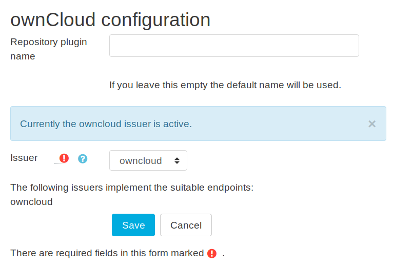
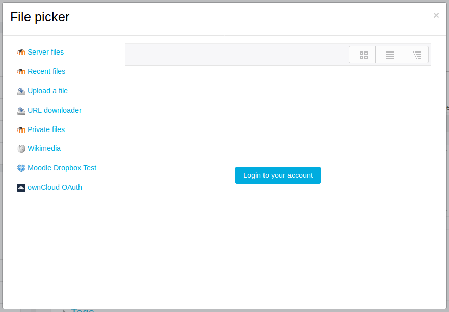
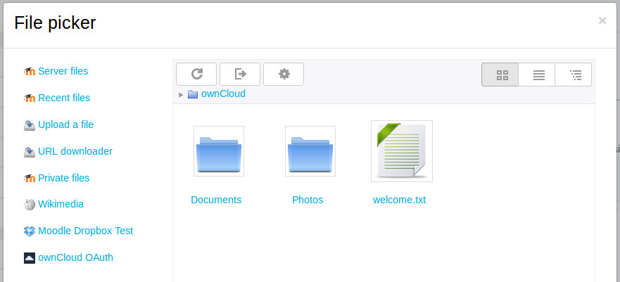

# Do not use in production
Please be aware that this Plugin is WIP. 
It is a conduction of the result of the project seminar sciebo@Learnweb of the University of Münster. 
** Do not use in production! ** Plugins and their structure **will** be subject to change. 
We will **NOT** support any upgrade paths from this release.

Nevertheless, we are actively working on a release. We would be extremely happy for (non-production) test users and developer contributions!

# Moodle Repository Plugin `owncloud`

[](https://travis-ci.org/pssl16/moodle-repository_owncloud)
[](https://codecov.io/gh/pssl16/moodle-repository_owncloud)

# English

This plugin enables moodle users to have direct access to their files from ownCloud in the *Moodle File Picker* and the *Url-Activity*. 
**Hitherto** it **was** depending on the [`oauth2owncloud` plugin](https://github.com/pssl16/moodle-tool_oauth2owncloud). 
Since the Moodle3.3 Release Moodle offers an additional API for registering OAuth2 Clients. 
Therefore, the plugin is customized to the new API. 

Created by the project seminar sciebo@Learnweb of the University of Münster.

## Installation

Copy the content of this repository to `repository/owncloud`. No additional settings are displayed to the admin when installing the plugin. 
However, when enabling the plugin the admin has to choose an issuer for authentication.

## Admin Settings

Repository Plugins are activated under `Site Administration ► Plugins ► Repositories`.
The following text describes how the necessary issuer is created with the Moodle API and secondly 
how the issuer can be chosen.

### Create Oauth2 Issuer
The ownCloud oauth2 issuer has to be registered in the admin menu `Dashboard ► Site administration ► Server ► OAuth 2 services`.
When adding the issuer the ClientID, Secret and baseurl are necessary. ClientID and Secret are generated in the ownCloud instance.
Additionally, Moodle has a second interface for adding endpoints. 
For the ownCloud Repository plugin four endpoints have to be registered (this is ownCloud specific): 
1. **token_endpoint** 
   
   ```baseurl``` + ```port``` + '/index.php/apps/oauth2/api/v1/token'

    e.g. the baseurl is ```https://someinstance.owncloud.de```
    
    then the port is ```443``` since it is https
    
    therefore the **token_endpoint-url** is ```https://someinstance.owncloud.de:443/index.php/apps/oauth2/api/v1/token```
2. **authorization_endpoint** 

   ```baseurl``` + ```port``` + '/index.php/apps/oauth2/authorize'
3. **webdav_endpoint** 	

   ```baseurl``` + ```port``` + '/remote.php/webdav'
4. **userinfo_endpoint** 

   However Moodle additionally requires a userinfo_endpoint that has no effect in the ownCloud repository. 

For further information on OAuth2 Clients visit the [Moodle Dokumentation on OAuth2](https://docs.moodle.org/dev/OAuth_2_API).

### Choose Oauth2 Issuer
The issuer can be chosen in the repository settings ```Site administration ► Plugins ► Repositories ► Manage repositories```.



The choice of issuer can trigger three different kinds of notifications :
1. Information (Blue Box) which states which issuer is currently chosen
2. Warning (Yellow Box) in case no issuer is chosen
3. Error (Red Box) in case the issuer is not valid for the plugin

## User View

This plugin is available in all activities where the file picker is used. However, course admins can disable it in the `Course Administration ► Repositories` menu.

In the file picker a login button is displayed (assuming that the user is not authenticated yet):



When the button is clicked a pop-up window or a new tab is opened and the user will be requested to login and authorize Moodle. If authorization is granted, the user sees a tabular listing of the files available:



Here the user can select files, reload the content and logout. For the settings the admin is redirected to the `oauth2owncloud` plugin.

Additional information can be found in our [documentation](https://pssl16.github.io).
# Current Status
TODOs:
* Writhe php unit test

# Deutsch

Dieses Plugin ermöglicht Nutzern direkten Dateien Zugriff ihrer ownCloud Dateien im *Moodle File Picker* und der *Link-Aktivität* mittels des OAuth2 Verfahrens.
Zur Authentifizierung wurde **bisher** das [`oauth2owncloud` plugin](https://github.com/pssl16/moodle-tool_oauth2owncloud) benutzt.
In der Version Moodle3.3 wurde eine zusätzliche Schnittstelle zum oauth2 Protokoll eingeführt. An diese wird das Plugin nun angepasst.

Erstellt vom Projektseminar sciebo@Learnweb der Westfälischen Wilhelms-Universität Münster.

## Installation

Kopieren Sie den Inhalt dieses Repositorys nach `repository/owncloud`.

## Admin Einstellungen

Repository Plugins werden unter `Site Administration ► Plugins ► Repositories` aktiviert.
Bitte benutzen sie den [englischen Teil der README](#create-oauth2-issuer) für genaueren Information zur Registrierung von OAuth2 Clients in der Moodle Schnittstelle.
## Sicht des Nutzers

Dieses Plugin ist in allen Aktivitäten verfügbar, die die Dateiauswahl nutzen. Kurs Administratoren können es jedoch unter `Course Administration ► Repositories` deaktivieren. Die Benutzung dieses Plugins kann nicht auf bestimmte Nutzergruppen begrenzt werden.

In der Dateiauswahl wird ein Login-Button angezeigt (angenommen der Nutzer hat sich noch nicht authentifiziert):


Beim Klicken auf den Button wird ein Pop-up Fenster oder ein neuer Tab geöffnet und der Nutzer wird darum gebeten, Moodle zu autorisieren. Wenn die Autorisierung gewährt wurde, sieht der Nutzer eine tabellarische Auflistung der verfügbaren Dateien:


Hier kann der Nutzer Dateien auswählen, die Inhalte neu laden und sich abmelden. Für die Einstellungen wird der Administrator zum `oauth2owncloud` Plugin weitergeleitet.

Nähere Informationen finden Sie in unserer [Dokumentation](https://pssl16.github.io).
