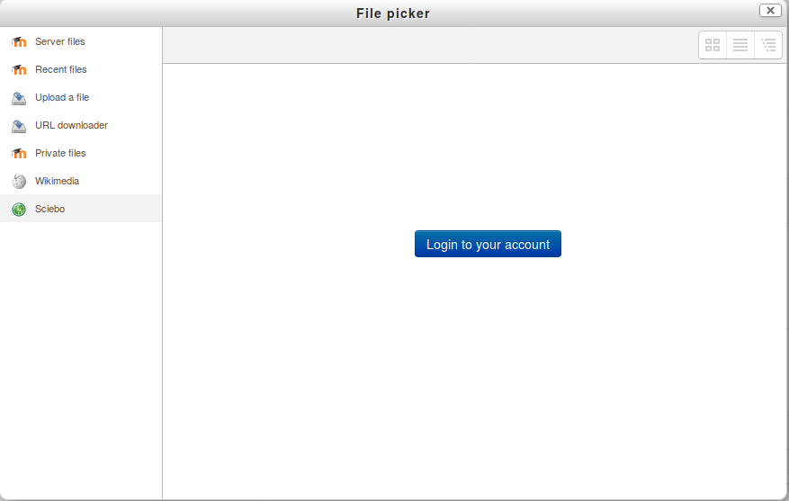
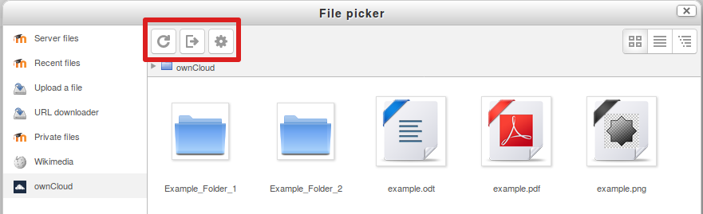

# moodle-repository_sciebo *(beta_candidate)*
# English
[]
(https://travis-ci.org/pssl16/moodle-repository_owncloud) 
This Repository connects ownCloud with Moodle.
This Plugin is a subplugin of [OAuth2Sciebo Plugin](https://github.com/pssl16/moodle-tool_oauth2sciebo).
It is written by the 
[ProjectsSeminar Sciebo@Learnweb](https://github.com/pssl16) of the University of Muenster.

## Installation
This Plugin should go into `repository/owncloud`.

### Admin Settings
Please ensure that all necessary settings are filled in the `admin_tool_oauth2owncloud` Plugin.
Otherwise the Plugin will not work. Repositorys plugins have to be activated from the side administrator
in `Site-Administration ► Plugins ► Repositories`. 
The admin can change the name of the plugin instance in the settings. This name is used globally.

### User View
The repository is available in course and private context, and has not to be activated by e.g. the course manager.
However course admins can delete the repository in the path `Course Administartion ► repositories`
The usage of the plugin can not be limited to specific user groups.
In the File Picker a login button is displayed (assumed that the user is not authenticated):
 
 

 When the button is clicked a pop-up window or a new tab
 is opened and the user will be requested to authorize the App.
When the user is successfully authenticated he sees a tabular listing of the available files:

The first icon in the red block is used to dynamically load the content. The second button can be used to logout. The last button is only available 
for admins and redirects to the `oauth2owncloud` settings.

For additional information *(only available in german)* please visit our [documentation page](https://pssl16.github.io).

# German

Dieses Repository Plugin bietet eine Schnittstelle zu einer ownCloud Instanz. Zur Nutzung dieses Plugins wird zuerst das
[oauth2owncloud Plugin](https://github.com/pssl16/moodle-tool_oauth2sciebo) benötigt. 
Die Installation ist nicht möglich, bevor das `admin_tool` installiert wurde.

## Installation

Das Plugin muss in `repository/owncloud` platziert werden. Um genutzt werden zu können muss ein Administrator 
das Plugin noch auf sichtbar schalten in `Site administration ► Plugins ► Repositories`.

### Admin Einstellungen
Bitte beachten Sie, dass in den Einstellungen des admin_tool alle notwendigen Einträge getätigt wurden, ansonsten funktioniert die Authentifizierung des Repositorys nicht. 
Repositorys Plugins müssen zusätzlich von einem Administrator unter dem Menüpunkt `Website-Administration ► Plugins ► Repositories ► Übersicht` aktiviert werden. 
Der Administrator kann dem Repository zusätzlich unter `Einstellungen` einen globalen Namen geben.

### Nutzer Sicht
Das Repository ist sowohl in den Kursen, als auch für private Instanzen verfügbar, und muss nicht mehr hinzugefügt werden. 
Kurs Administratoren können das Repository jedoch unter `Speicherorte` löschen. 
Die Nutzung lässt sich nicht auf bestimmte Nutzer oder Aktivitäten einschränken. 
Im File Picker wird der Nutzer (wenn er nicht angemeldet ist) zunächst zum Login aufgefordert: 

 
 
Drückt er diesen Button erscheint ein Popup-Window oder ein neuer Tab in dem der Nutzer 
sich in ownCloud anmeldet und die App autorisiert. 
Nach erfolgreicher Autorisierung sieht der Nutzer eine tabellarische Auflistung der vorhandenen Dateien:

Im roten Kasten sehen sie Buttons um den Inhalt neu zu laden, sich auszuloggen und nur als Admin sieht man den 
letzten Button in dem man die Einstellungen des `oauth2owncloud` plugins bearbeiten kann.

Für genauere Informationen besuchen sie unsere [Website Dokumentation](https://pssl16.github.io).